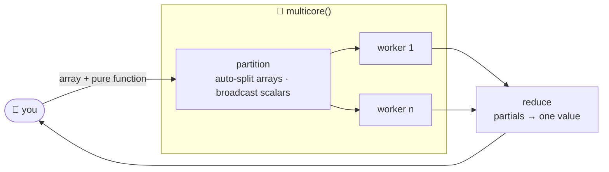
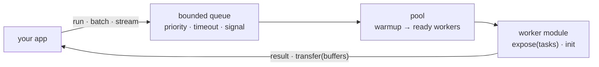

# defuss-multicore

[](LICENSE)
[](package.json)
[](tsconfig.base.json)
[](package.json)

**Multi**core for JavaScript: one `await` for every CPU core, zero dependencies.

Web Workers in the browser and `worker_threads` in Node.js behind the same API and the same types. Pure functions are auto-split across cores, typed module workers get a real task pool, and the vector/matrix kernels are JIT loop-unrolled on the caller thread.

## TL;DR

A JavaScript runtime gives your code one thread. Heavy compute blocks the UI or the event loop, and no amount of `Promise.all` buys a second core.

defuss-multicore moves compute to the cores you already have. It splits arrays and TypedArrays into compact partitions, runs each partition in a real worker, and hands the results back through one `await` — the same code in the browser and in Node.

- 🔁 **Isomorphic:** Web Workers (browser) and `worker_threads` (Node.js) behind one API
- ⚡ **Loop-unrolled kernels:** `matmul`, `dotProduct`, `matadd`, `matsub`, `matdiv` JIT-select 4x/8x/16x unroll factors
- 🧮 **Parallel array methods:** `map`, `filter`, `reduce` for any array, auto-partitioned across cores
- 🧩 **Typed module workers:** real ESM imports and module-local state, driven by an explicit task pool
- 🚏 **A pool with a contract:** bounded queue, stable priorities, per-task timeouts, cancellation that stops running work
- 🔒 **Explicit ownership:** `multicore()` transfers only internal partition copies — your buffers are never detached; pool transfers are opt-in and listed by you
- 🧯 **Predictable failure:** a crashed worker rejects only its own active job; nothing is retried silently
- 🪶 **Tiny:** zero runtime dependencies, ESM + CJS dual output, Node ≥ 18.17.1 and every modern browser

## How it works



For real application code — imports, module state, async handlers — the second path is a typed task pool:



| API | When you reach for it | What it does |
|---|---|---|
| **`multicore(fn, options?)`** | batch data + a pure function | Wraps `fn` for parallel execution. Array/TypedArray args are auto-split across cores, scalars are broadcast to every worker, partial results are collected — or reduced to one value via `reduce`. Falls back to the main thread below `threshold`. |
| **`map` / `filter` / `reduce`** | big arrays, familiar semantics | Parallel counterparts of the `Array.prototype` methods; the reducer must be associative. Pools are cached per callback and released explicitly via `releaseArrayWorkers`. |
| **`createPool()` + `expose()`** | real application code | Typed module workers with normal ESM imports and module-local state: batching, streaming, priorities, timeouts, cancellation. Always worker execution — no size threshold, no silent main-thread fallback. |
| **`dotProduct`, `matmul`, `matadd`, …** | numeric kernels | JIT loop-unrolled (4x/8x/16x, auto-selected) vector/matrix math, synchronous on the caller thread. Combine with `multicore()` or a pool to move them into workers. |

## Install

```bash
bun add defuss-multicore
# or: npm install defuss-multicore
```

## Quick Start

```ts
import { multicore, dotProduct, matmul, matadd } from "defuss-multicore";

// 1. Wrap any pure function for parallel execution
const parallelSum = multicore(
  (chunk: number[]) => chunk.reduce((a, b) => a + b, 0),
  { reduce: (a: number, b: number) => a + b },
);

const total = await parallelSum([1, 2, 3, /* ...millions of items */ ]);

// 2. Use built-in optimized ops
const scores = dotProduct(embeddings, queries);         // Float32Array
const C      = matmul(A, B);                            // Float64Array[]
const sum    = matadd(A, B);                            // Float64Array[]
```

## API

### `multicore(fn, options?)`

Higher-order function that wraps a **pure function** for parallel execution across CPU cores.

```ts
const parallel = multicore(fn, options?);
const results  = await parallel(data);           // collect all results
for await (const r of parallel(data)) { ... }    // stream as workers finish
```

- Array/TypedArray args are **auto-split** across cores
- Scalar args are **broadcast** to every worker
- Returns `ParallelResult<R>` — both `PromiseLike<R[]>` and `AsyncIterable<R>`
- The callable also exposes `warmup()`, `close()` and `terminate()`

#### `MulticoreOptions<R>`

| Option      | Type                      | Default                | Description |
|-------------|---------------------------|------------------------|-------------|
| `cores`     | `number`                  | available CPU cores    | Number of worker threads |
| `threshold` | `number`                  | `1024`                 | Min array length before parallelizing (falls back to main thread below this) |
| `reduce`    | `(a: R, b: R) => R`      | -                      | Reduce partial results into a single value |
| `eager`     | `boolean`                 | `false`                | Pre-spawn workers immediately instead of on first call |

#### `CallOptions` (per-call overrides)

| Option     | Type           | Default  | Description |
|------------|----------------|----------|-------------|
| `cores`    | `number`       | -        | Override partition count for this call (within the pool cap) |
| `signal`   | `AbortSignal`  | -        | Cancel in-flight workers |
| `transfer` | `boolean`      | `true`   | Transfer the internally created partition buffers (see ownership note below) |

**Ownership note:** TypedArray inputs are copied into compact, independently owned partitions; only those internal copies are transferred — your caller-owned buffers are never detached. Disable with `{ transfer: false }`.

**Function constraints:** `fn` is serialized via `fn.toString()` — it must be self-contained: no captured closures, no imports, no DOM access. Async chunk functions are awaited. For application code with real imports and module-local state, use [module workers](#module-workers--task-pools) instead.

### `map(array, fn, options?)`

Parallel `Array.prototype.map`. Distributes work across cores, flattens results.

```ts
import { map } from "defuss-multicore";

const doubled = await map(hugeArray, (x) => x * 2);
```

### `filter(array, fn, options?)`

Parallel `Array.prototype.filter`.

```ts
import { filter } from "defuss-multicore";

const evens = await filter(hugeArray, (x) => x % 2 === 0);
```

### `reduce(array, fn, initial, options?)`

Parallel `Array.prototype.reduce`. Each worker reduces its chunk, then partial results are reduced on the main thread. The reducer must be **associative** — regrouping can change floating-point rounding, so this is not a drop-in replacement for sequential `Array.reduce`.

```ts
import { reduce } from "defuss-multicore";

const sum = await reduce(hugeArray, (a, b) => a + b, 0);
```

`map`/`filter`/`reduce` cache one pool per callback + core configuration. Use `releaseArrayWorkers(callback)` to release a cached pool explicitly; idle workers otherwise expire.

### Module workers & task pools

For real application code — normal ESM imports, module-local state, async handlers — define a typed worker module and drive it with an explicit task pool.

`worker.ts` — runs inside the worker:

```ts
import { expose, transfer } from "defuss-multicore/worker";

let calls = 0;
export const tasks = {
  sum(values: Float64Array) {
    let total = 0;
    for (const value of values) total += value;
    return total;
  },
  async counter(_: null) { return ++calls; },
  double(values: Float64Array<ArrayBuffer>) {
    for (let i = 0; i < values.length; i++) values[i] *= 2;
    return transfer({ values }, [values.buffer]); // explicit zero-copy move
  },
};

await expose(tasks, { init: async () => { calls = 0; } });
```

Application side (browser shown; Node is identical with `Worker` from `node:worker_threads`):

```ts
import { createPool } from "defuss-multicore";
import type { tasks } from "./worker.js";

const pool = createPool<typeof tasks>({
  worker: () => new Worker(new URL("./worker.ts", import.meta.url), { type: "module" }),
  maxWorkers: 2,
  maxQueue: 32,
});

try {
  await pool.warmup();
  const input = new Float64Array([1, 2, 3]);
  const result = await pool.run("double", input, { transfer: [input.buffer] });
  console.log(result.values); // [2, 4, 6]; input.buffer is detached
} finally {
  await pool.close();
}
```

Keep the `new Worker(new URL(..., import.meta.url), { type: "module" })` expression at the application call site so Vite can bundle the worker graph (use `worker.format: "es"` for top-level await). See [examples/node](examples/node) and [examples/vite](examples/vite).

#### Pool contract

| API | Behavior |
| --- | --- |
| `createPool<Tasks>(options)` | One explicit pool shared by all registered task names. Default workers: `max(1, min(4, cores - 1))`. |
| `run(name, payload, options?)` | Always worker execution — no size threshold or silent main-thread fallback. Awaits sync/async handlers. |
| `batch(name, jobs, options?)` | Ordered results. Default `chunkSize: 1`, `concurrency: maxWorkers`. Bounded outstanding chunks. |
| `stream(name, jobs, options?)` | Actual completion order across chunks; input order within each chunk. Yields `{ index, value }` with backpressure. |
| `warmup(count?)` | Spawn up to the pool cap and await module init/ready handshakes. |
| `close()` | Reject new submissions, drain accepted work, await termination. Idempotent. |
| `terminate()` | Reject pending/active jobs, stop workers, await shutdown. Idempotent. |
| `stats` | `workers`, `ready`, `active`, `queued`, lifecycle `state`, cumulative `completed`/`failed`/`cancelled`. |

Pool options: `maxWorkers`, `maxQueue` (default 128), `idleTimeoutMs` (30,000), `startupTimeoutMs` (10,000), `onTask(timing)`.

`run` options: `signal`, `transfer` (explicit list), `priority` (larger first; FIFO for ties; never preempts), `timeoutMs` (covers queue wait + execution).

`batch`/`stream` additionally accept `chunkSize`, `concurrency` and `transfer(payload, index)`. Each chunk invokes the single-item handler sequentially, amortizing one round trip across its items.

#### Lifecycle, errors and cancellation

`expose(tasks, { init })` awaits initialization before accepting tasks; every replacement worker re-initializes. Jobs execute sequentially per worker, and workers retain module-local caches between jobs — keep caches bounded and reconstructible.

Queued cancellation removes the job immediately. Cancelling or timing out a *running* job terminates its worker (**hard cancellation** — `finally` blocks are not guaranteed) and reschedules waiting work on surviving/replacement workers. Worker crashes reject only that worker's active job; tasks are never retried automatically.

Payloads and results are structured-cloned by default. `transfer(value, list)` moves listed buffers (including nested ones) — this detaches the sender's *entire* backing buffer, aliases included, and cancellation does not restore moved inputs. `SharedArrayBuffer` is never transferred; shared-memory synchronization is the caller's responsibility.

### `dotProduct(as, bs)`

Batch dot product of vector pairs. JIT loop-unrolled (up to 16x unroll).

```ts
import { dotProduct } from "defuss-multicore";

// 100K pairs of 768-dim vectors (e.g. embedding similarity)
const scores: Float32Array = dotProduct(embeddings, queries);
```

- Input: arrays of vector pairs (each inner element is one vector)
- Output: `Float32Array` of dot products

### `matmul(A, B)`

Matrix multiplication with transpose optimization + loop unrolling.

```ts
import { matmul } from "defuss-multicore";

// A: MxK, B: KxN => C: MxN
const C: Float64Array[] = matmul(A, B);
```

### `matadd(A, B)` / `matsub(A, B)` / `matdiv(A, B)`

Element-wise matrix operations with loop unrolling.

```ts
import { matadd, matsub, matdiv } from "defuss-multicore";

const sum  = matadd(A, B);
const diff = matsub(A, B);
const quot = matdiv(A, B);
```

All matrix ops use `Matrix<Float64Array>` — an array of row vectors (`Float64Array[]`). The math ops run **synchronously on the caller thread**; combine them with `multicore()` or a task pool if you want them in workers.

### `getPoolSize()`

Returns the number of available CPU cores (used as default worker count).

```ts
import { getPoolSize } from "defuss-multicore";

console.log(`Using ${getPoolSize()} cores`);
```

### Types

```ts
type NumericArray = number[] | Float32Array | Float64Array | Int8Array | ...;
type Matrix<T>   = T[];       // Array of row vectors (e.g. Float64Array[])
type Vectors<T>  = T[];       // Array of vectors

interface ParallelResult<R> extends AsyncIterable<R>, PromiseLike<R[]> {}
```

## Speed

All benchmarks measured on Node.js (worker_threads) on Apple Silicon (10 cores). Median of 5 runs, 2 warmup. Reproduce with `bun run bench` (or `npm run bench`).

### Loop-unrolled ops vs naive baseline

Single-threaded comparison — same thread, unrolled kernels vs naive loops:

| Operation | Size | Speedup |
|-----------|------|---------|
| **matmul** | 200 x 300 x 200 | **2.36x** |
| **matadd** | 1000 x 1000 | **2.11x** |
| **matmul** | 500 x 500 | **2.06x** |
| **dotProduct** | 100K x 768-dim | **1.46x** |
| **matsub** | 1000 x 1000 | 0.49x |
| **matdiv** | 1000 x 1000 | 0.37x |

Loop unrolling shines on **compute-heavy inner loops** like matrix multiplication, where the unrolled kernel avoids branch overhead and allows the CPU to pipeline instructions. Element-wise ops (add/sub/div) benefit less because the operation per element is trivial — the memory access pattern dominates.

### Multicore workers vs single-thread

Worker parallelism — dispatching across all CPU cores vs running on the main thread:

| Workload | Size | Speedup |
|----------|------|---------|
| **Key stretching** (PBKDF2-like) | 100K x 1000 rounds | **4.89x** |
| **CRC32** (network packets) | 10K x 4KB | **1.31x** |
| **CRC32** (small messages) | 500K x 64B | 0.80x |
| **Transform** (sin+cos) | 5M items | 0.60x |
| **FNV-1a** hash | 1M x 128B | 0.44x |
| **Filter** elements | 2M items | 0.39x |
| **Sum** (accumulate) | 10M items | 0.06x |

### Task-pool workload (module workers)

`bun run bench:tasks` runs the same deterministic chunk kernel on the caller thread and on 1/2/4 pooled workers, comparing every output element for exact equality. On the verification machine (64 chunks, 1 MiB output, warmed workers):

| Workers | Startup ms | Median task ms |
| --- | ---: | ---: |
| Caller thread | — | 44.78 |
| 1 | 100.73 | 58.73 |
| 2 | 123.33 | 26.81 |
| 4 | 153.92 | 17.55 |

Four warmed workers were ~2.55x faster than the caller thread, but cold startup exceeded the task duration, and one worker was *slower* than no workers. Persistent reuse and sufficiently large jobs matter.

## When to use it

The benchmarks tell a clear story: **worker parallelism pays off when each chunk does meaningful CPU work**. The overhead of serializing data, posting messages, and collecting results is ~2-10ms per dispatch. If the per-chunk work is under that threshold, you lose.

### DO: parallelize these

- **Key derivation / password hashing** — thousands of rounds per item (4.9x speedup)
- **Batch checksumming** (CRC32, SHA, etc.) of large messages — enough work per chunk to amortize dispatch
- **Heavy per-element computation** — image processing, physics simulation, compression
- **Any workload where each chunk runs >5ms** on a single core

### DON'T: parallelize these

- **Simple reductions** (sum, min, max) — main-thread loop is faster than worker dispatch
- **Trivial transforms** (multiply, add constant) — memory-bandwidth bound, not CPU-bound
- **Small arrays** (<1024 elements) — the `threshold` option exists for this reason
- **Single function calls** — multicore is for **batches**, not individual invocations
- **I/O-bound work** — fetch, file reads, DB queries are already async; workers add overhead

### DO: use loop-unrolled ops

- **`matmul`** for matrix multiplication, neural network layers (2x+ speedup)
- **`matadd`** for accumulating matrices (2.1x)
- **`dotProduct`** for embedding similarity, cosine distance, attention scores (1.5x+ speedup)

### Key principles

1. **Measure first.** The `threshold` option exists so small inputs fall back to the main thread automatically. But "small" depends on your workload — a 10K-element array of simple additions is too small; a 10K-element array of 1000-round hash stretches is perfect.

2. **Worker functions must be pure.** `multicore()` serializes functions into isolated contexts — no closures, no imports, no DOM access. Everything the function needs must be passed as arguments or computed inline. Need imports and module state? Use module workers with `createPool()`.

3. **Transfers are explicit for pools, partition-only for `multicore()`.** With task pools you list transferables yourself (`transfer: [buf]`) and the buffer detaches. With `multicore()`, only internal partition copies are transferred — your inputs stay attached. Use `{ transfer: false }` to disable partition transfers.

4. **Use `reduce` for aggregation.** Without it, you get back an array of partial results (one per worker). With `reduce`, partial results are combined into a single value.

5. **Use `eager: true` (or `warmup()`) for latency-sensitive paths.** By default, worker pools are created lazily on first call. Pre-spawn workers when the first call must be fast.

## Patterns

### Crypto/compression worker

```ts
import { multicore } from "defuss-multicore";

const parallelCRC32 = multicore(
  (seeds: number[]) => {
    // Build CRC32 lookup table inside worker (no closures!)
    const table = new Uint32Array(256);
    for (let i = 0; i < 256; i++) {
      let c = i;
      for (let j = 0; j < 8; j++) c = c & 1 ? 0xEDB88320 ^ (c >>> 1) : c >>> 1;
      table[i] = c;
    }

    const results = new Uint32Array(seeds.length);
    for (let idx = 0; idx < seeds.length; idx++) {
      const buf = generateMessage(seeds[idx]); // deterministic from seed
      let crc = 0xFFFFFFFF;
      for (let i = 0; i < buf.length; i++) {
        crc = table[(crc ^ buf[i]) & 0xFF] ^ (crc >>> 8);
      }
      results[idx] = (crc ^ 0xFFFFFFFF) >>> 0;
    }
    return results;
  },
  {
    threshold: 256,
    reduce: (a: Uint32Array, b: Uint32Array) => {
      const merged = new Uint32Array(a.length + b.length);
      merged.set(a, 0);
      merged.set(b, a.length);
      return merged;
    },
  },
);

const checksums = await parallelCRC32(messageIndices);
```

### Streaming results

```ts
const parallel = multicore(heavyComputation);

// Stream results as each worker finishes (submission order)
for await (const result of parallel(data)) {
  console.log("Worker finished:", result);
}

// Task pools: actual completion order across chunks
for await (const { index, value } of pool.stream("taskName", jobs)) {
  console.log(index, value);
}
```

### Cancellation

```ts
const controller = new AbortController();
const parallel = multicore(expensiveFn);

const result = parallel(data, { signal: controller.signal });

// Cancel after 5 seconds
setTimeout(() => controller.abort(), 5000);

try {
  await result;
} catch (e) {
  console.log("Cancelled");
}
```

## What "verified" means

Every claim in this README is backed by a suite you can run. A missing check counts as unverified, and unverified fails `bun run verify`.

- `bun run test` — 293 unit tests on Node.js (`worker_threads`): partitioning, transfer ownership, cancellation, crash isolation, queue bounds
- `bun run test:browser` — 25 E2E tests in real Chromium via Playwright (Web Workers, no mocks)
- `bun run test:production` — builds the Vite example with the production bundler and runs real browser workers against the built artifact
- `bun run test:package` — installs the published tarball in an isolated directory and exercises both the ESM and the CJS entry points
- `bun run verify` — all of the above plus `tsc` typechecks, including compile-time negative tests for wrong result types

Browser tests need Chromium: `bunx playwright install chromium`, or set `PLAYWRIGHT_CHROMIUM_EXECUTABLE` to an existing executable. All `npm run ...` equivalents work as well.

### Deliberate limits

No automatic retries, no worker affinity, no cross-worker state synchronization, no shared-memory protocol, no distributed execution, no automatic tuning. The math kernels are synchronous and stay on the caller thread. `close()` waits for non-terminating tasks that lack timeouts — use `terminate()` to stop them. Stale-result checks and authoritative state commits remain caller responsibilities. Implementation history and compatibility notes live in [CHANGELOG.md](CHANGELOG.md).

## Requirements

- **Node.js** ^18.17.1 || ^20.3.0 || >=21.0.0 (developed and verified on Node 24)
- **Bun** 1.x works as installer, script runner and runtime
- **Browser** — any browser with Web Workers + structured clone (module workers require ES module worker support)

## Citation

If you use defuss-multicore in research or want to reference it, cite it as:

```bibtex
@misc{homberg2026defussmulticore,
  author       = {Homberg, Aron},
  affiliation  = {Independent Researcher},
  title        = {defuss-multicore: Isomorphic Multicore Execution and Loop-Unrolled Linear Algebra for JavaScript},
  year         = {2026},
  version      = {0.1.0},
  howpublished = {\url{https://www.npmjs.com/package/defuss-multicore}},
  note         = {npm package, MIT License}
}
```

## License

MIT — see [LICENSE](LICENSE).
